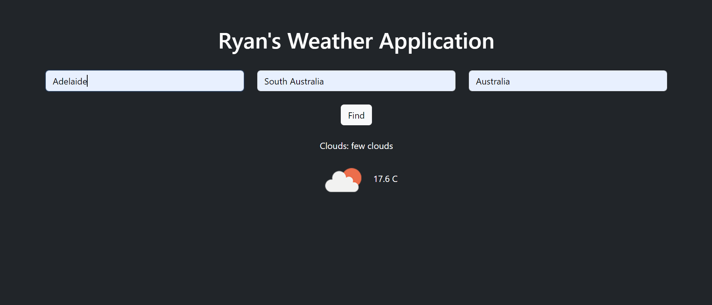

# Weather App

Welcome to the Weather App! This project is a Python-based application that fetches and displays weather information for a specified location. The app uses a weather API to provide current weather conditions and temperature.

## Features

- **Current Weather:** Get real-time weather updates for any location.
- **Temperature:** Displays the current temperature in both Celsius and Fahrenheit.
- **Weather Description:** Gives a brief description of the current weather conditions (e.g., clear sky, rain).

## Installation

To get started with the Weather App, follow these steps:

1. **Clone the repository:**
   git clone https://github.com/RyanHalliwellAI/WeatherAppPython.git
2. **Create and activate a virtual environment**
    python -m venv venv
    venv\Scripts\activate
3. **Install dependencies**
    pip install -r requirements.txt
4. **Obtain API Key**
    Sign upto OpenWeatherMap and generate an API Key
5. **Create .env file**
    Create an .env file to save your API key
    API_KEY=your_api_key_here
6. **Usage**
    python app.py

## Acknowledgements
- **OpenWeatherMap** for providing the weather data API.
- **Requests** library for making HTTP requests.
- **dotenv** for managing environment variables.

